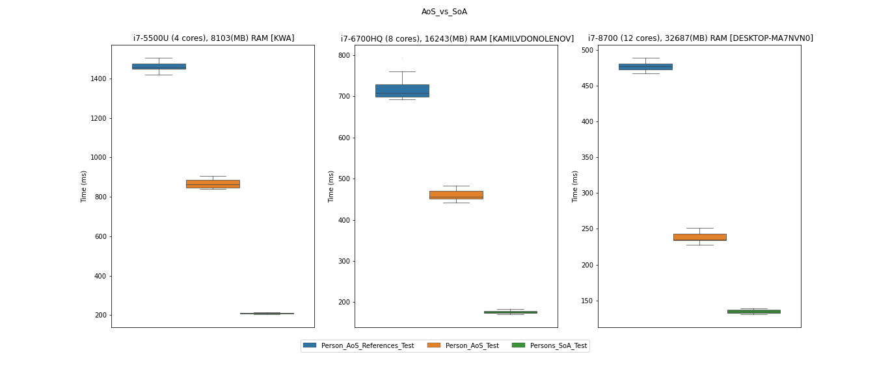
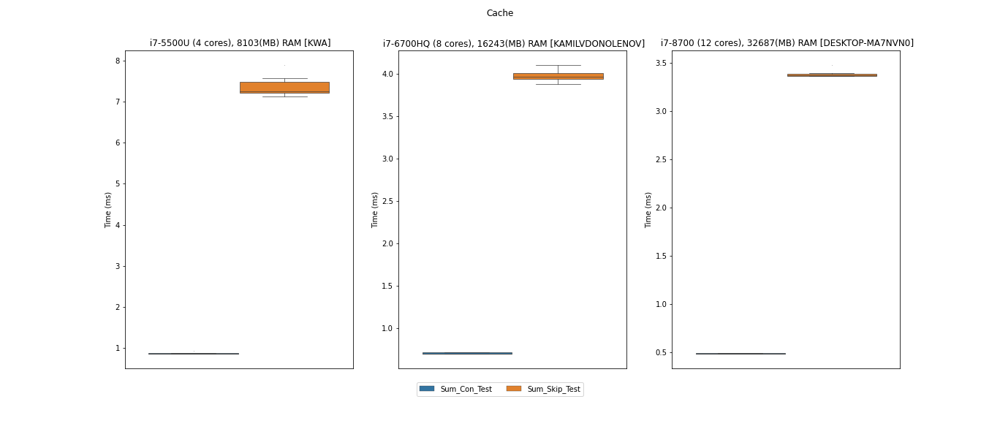
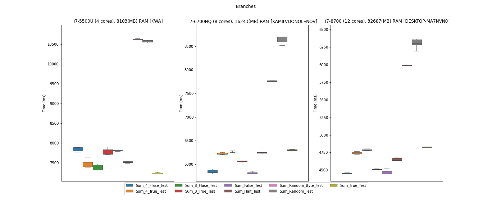

# DOD (Data oriented design) Performance Benchmarks

__This project is part of my thesis research__

This repo contains benchmarks which tests three performance groups:
* AoS (Array of structures) vs SoA (Structure of arrays) in _AoS_vs_SoA.cs_
* CPU cache in _Cache.cs_
* Branches - branch prediction and branch miss prediction in _Branches.cs_
___
Project uses Unity engine and Performance Testing Extension for Unity Test Runner for benchmarking purposes.
If you want share your results please contact me at: kamilvdono@gmail.com or [in - Kamil Socha](https://www.linkedin.com/in/kamil-socha/)
___
For performance reports go to [Results](Results/) directory
Results charts:

___
## TODO:
- [x] Share my results
- [x] Visualize results
- [x] Gather results from multiple machines